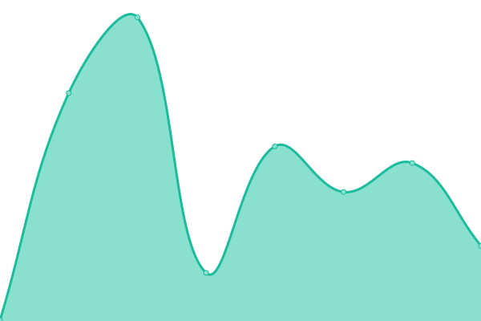
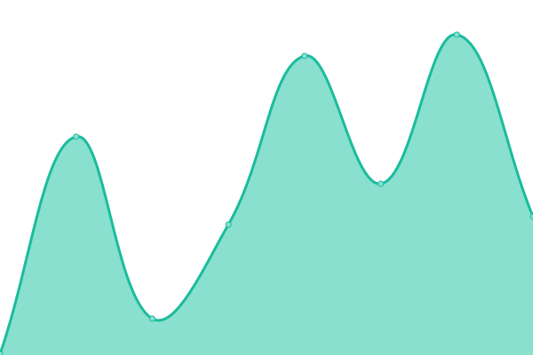
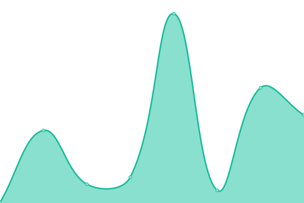
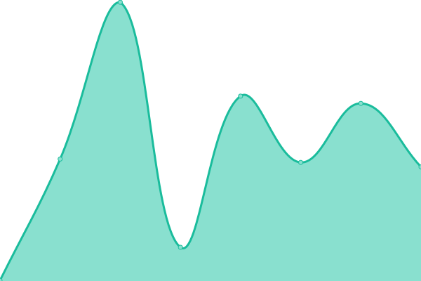
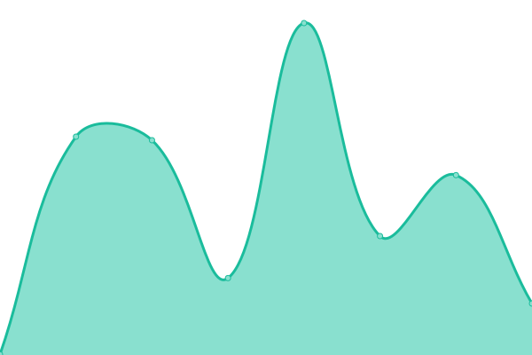

# [📈 Live Status](https://status.tiste.io): <!--live status--> **🟩 All systems operational**

This repository contains the open-source uptime monitor and status page for [Baptiste Lecocq](https://tiste.io), powered by [Upptime](https://github.com/upptime/upptime).

With [Upptime](https://upptime.js.org), you can get your own unlimited and free uptime monitor and status page, powered entirely by a GitHub repository. We use [Issues](https://github.com/tiste/status/issues) as incident reports, [Actions](https://github.com/tiste/status/actions) as uptime monitors, and [Pages](https://status.tiste.io) for the status page.

<!--start: status pages-->
<!-- This summary is generated by Upptime (https://github.com/upptime/upptime) -->
<!-- Do not edit this manually, your changes will be overwritten -->
<!-- prettier-ignore -->
| URL | Status | History | Response Time | Uptime |
| --- | ------ | ------- | ------------- | ------ |
|  [1 à 10](https://1a10.app) | 🟩 Up | [1-a-10.yml](https://github.com/tiste/status/commits/HEAD/history/1-a-10.yml) | 

 196ms
     
 | 

<a href="https://status.tiste.io/history/1-a-10">100.00%</a>
    

|  [1 à 10 API](https://api.1a10.app/api/health) | 🟩 Up | [1-a-10-api.yml](https://github.com/tiste/status/commits/HEAD/history/1-a-10-api.yml) | 

 1208ms
     
 | 

<a href="https://status.tiste.io/history/1-a-10-api">100.00%</a>
    

|  [cronping](https://cronping.tiste.io) | 🟩 Up | [cronping.yml](https://github.com/tiste/status/commits/HEAD/history/cronping.yml) | 

 910ms
     
 | 

<a href="https://status.tiste.io/history/cronping">100.00%</a>
    

|  [Engraver](https://engraver.tiste.io) | 🟩 Up | [engraver.yml](https://github.com/tiste/status/commits/HEAD/history/engraver.yml) | 

 150ms
     
 | 

<a href="https://status.tiste.io/history/engraver">100.00%</a>
    

|  [Hey Be See](https://heybesee.fr) | 🟩 Up | [hey-be-see.yml](https://github.com/tiste/status/commits/HEAD/history/hey-be-see.yml) | 

 229ms
     
 | 

<a href="https://status.tiste.io/history/hey-be-see">100.00%</a>
    

|  [Setlist](https://setlist.live) | 🟩 Up | [setlist.yml](https://github.com/tiste/status/commits/HEAD/history/setlist.yml) | 

 146ms
     
 | 

<a href="https://status.tiste.io/history/setlist">100.00%</a>
    

|  [Setlist app](https://app.setlist.live) | 🟩 Up | [setlist-app.yml](https://github.com/tiste/status/commits/HEAD/history/setlist-app.yml) | 

 171ms
     
 | 

<a href="https://status.tiste.io/history/setlist-app">100.00%</a>
    

|  [Setlist API](https://api.setlist.live/health) | 🟩 Up | [setlist-api.yml](https://github.com/tiste/status/commits/HEAD/history/setlist-api.yml) | 

 583ms
     
 | 

<a href="https://status.tiste.io/history/setlist-api">100.00%</a>
    

|  [Swunitch](https://convertisseur-temps-course.tiste.io) | 🟩 Up | [swunitch.yml](https://github.com/tiste/status/commits/HEAD/history/swunitch.yml) | 

 237ms
     
 | 

<a href="https://status.tiste.io/history/swunitch">100.00%</a>
    

|  [Swunitch API](https://swunitch-api.tiste.io/races) | 🟩 Up | [swunitch-api.yml](https://github.com/tiste/status/commits/HEAD/history/swunitch-api.yml) | 

 645ms
     
 | 

<a href="https://status.tiste.io/history/swunitch-api">100.00%</a>
    

|  [Yahtzee app](https://yahtzee.game) | 🟩 Up | [yahtzee-app.yml](https://github.com/tiste/status/commits/HEAD/history/yahtzee-app.yml) | 

 133ms
     
 | 

<a href="https://status.tiste.io/history/yahtzee-app">100.00%</a>
    

|  [Yahtzee API](https://api.yahtzee.game) | 🟩 Up | [yahtzee-api.yml](https://github.com/tiste/status/commits/HEAD/history/yahtzee-api.yml) | 

 503ms
     
 | 

<a href="https://status.tiste.io/history/yahtzee-api">100.00%</a>
    

|  [www](https://tiste.io) | 🟩 Up | [www.yml](https://github.com/tiste/status/commits/HEAD/history/www.yml) | 

 116ms
     
 | 

<a href="https://status.tiste.io/history/www">100.00%</a>
    

<!--end: status pages-->

[**Visit our status website →**](https://status.tiste.io)

## 📄 License

- Powered by: [Upptime](https://github.com/upptime/upptime)
- Code: [MIT](./LICENSE) © [Baptiste Lecocq](https://tiste.io)
- Data in the `./history` directory: [Open Database License](https://opendatacommons.org/licenses/odbl/1-0/)
